Version française : [README.fr.md](README.fr.md)

# Listo

**Listo is an app for shared lists (shopping, tasks, gift ideas), designed for the phone, that you install on your own server.** Free, ad-free, in French and English, for a family or a small group of close friends.

## The essentials

- **Lists shared live**: an item checked on one phone is checked on the others within seconds; each person has their own right, “Can edit” or “Read only”.
- **Three types of list**: shopping (sorted by aisle, or by store for a round of shops), tasks (priority, due date, repeat, assignment) and wishes (reserving and chipping in, without the person being spoiled knowing; a “To give” list gathers, automatically, the gifts you reserved, with a “Bought” box only you can see).
- **Quick entry**: several items at once, quantity read from the name, barcode scanning, photos.
- **Home, notes and offline**: Listo opens on tiles that show at a glance your due tasks (overdue, today, later), your lists by type, your gifts to buy, your latest notes and your account (each person chooses which tiles to show and in what order, or turns Home off and picks the first screen); notes are free text that saves itself, with clickable links, pinning and their own trash, shared like lists (“Can edit” or “Read only”, what's new, notifications) or through a read-only public link (two people or devices writing at once never overwrite each other: you choose the version to keep), and anyone who doesn't use them can turn them off for themselves in Settings › Features, without deleting anything; it opens and works without a network, and everything is sent when the network comes back.
- **On a computer** (window at least 1,024 px wide): two areas (a menu on the left that follows the screen, open list), item details and sharing in a panel, keyboard shortcuts (“?” lists them; they can be turned off) and Ctrl+Z to undo a deletion, a check or an edit. On the phone, nothing changes.
- **Public link** to show a list or a note to someone without an account, **trash** kept for 30 days; **AI assistants** that follow the MCP standard (for example Claude, by Anthropic) can read your lists and, if you allow it, write to them, with two levels of permission, always after you approve on an “Authorize an AI assistant” screen, and without ever deleting anything.
- **Notifications**: other people's changes (grouped, plus tasks assigned to you), reservations, sharing, a due-date summary every morning and task reminders, kept for 30 days on the **Notifications page** (the bell on Home, read or unread, same on every device, even without push notifications); and, optional and off by default, on the phone or the computer as push notifications.
- **Security**: two-factor authentication, nightly backup, rights checked by the server. **A single numbered guide**, the same in the app (Settings › Help), online at **<https://magicgg91.github.io/listo/>** (in French: <https://magicgg91.github.io/listo/fr/>) and in the repository: [docs/guide.en.md](docs/guide.en.md).

## Screenshots

| 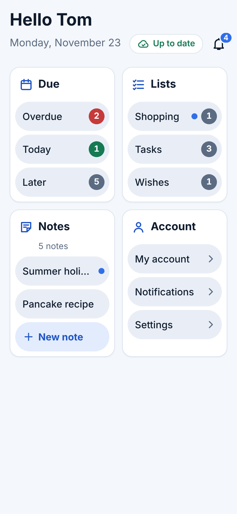 | 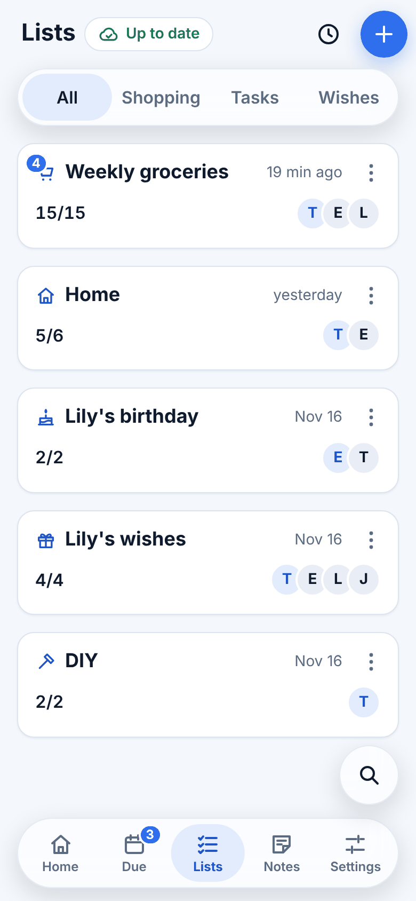 | 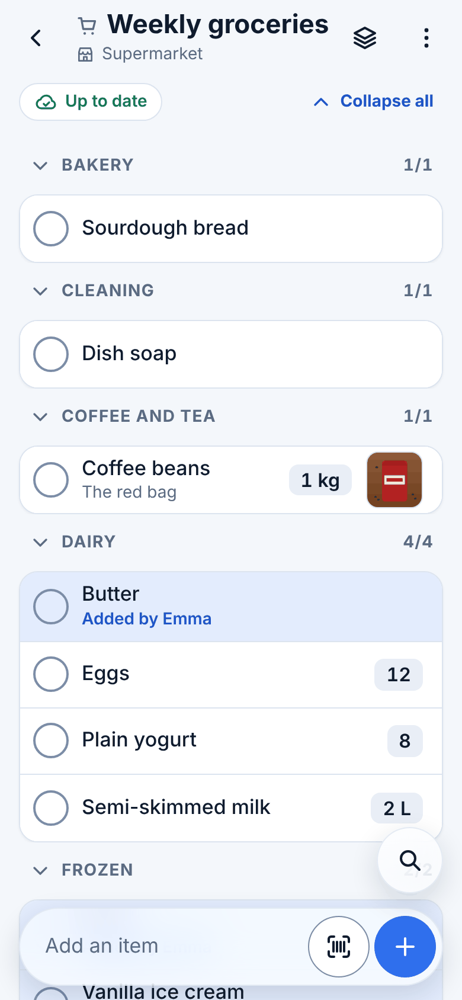 | 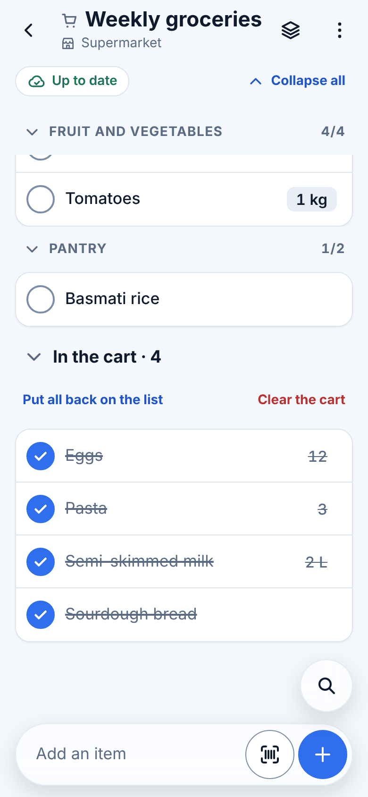 | 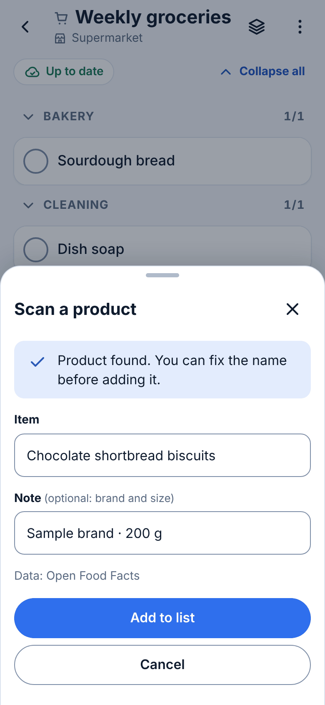 |
| :---: | :---: | :---: | :---: | :---: |
| Home | Lists | Shopping by aisle | “In the cart” | Scan mode |
| 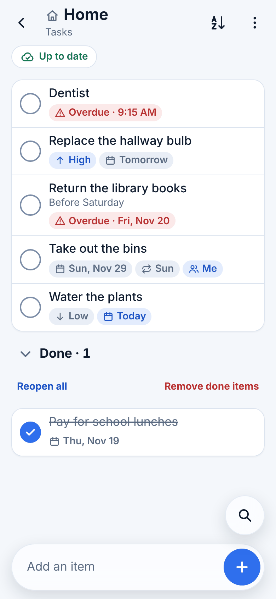 | 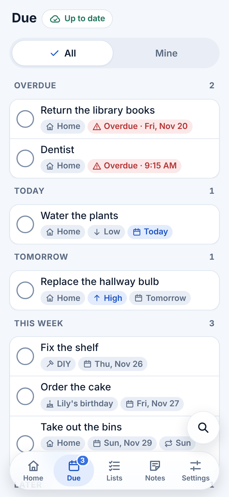 | 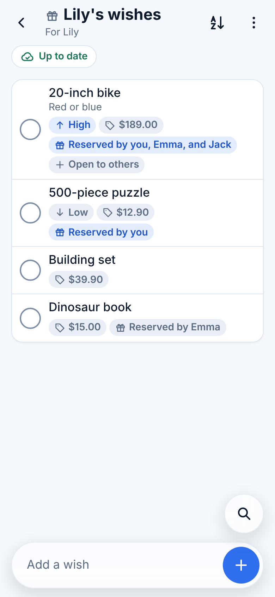 | 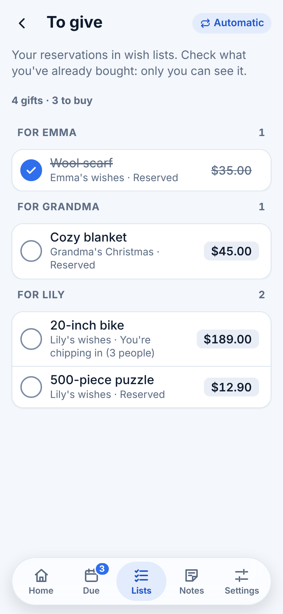 | 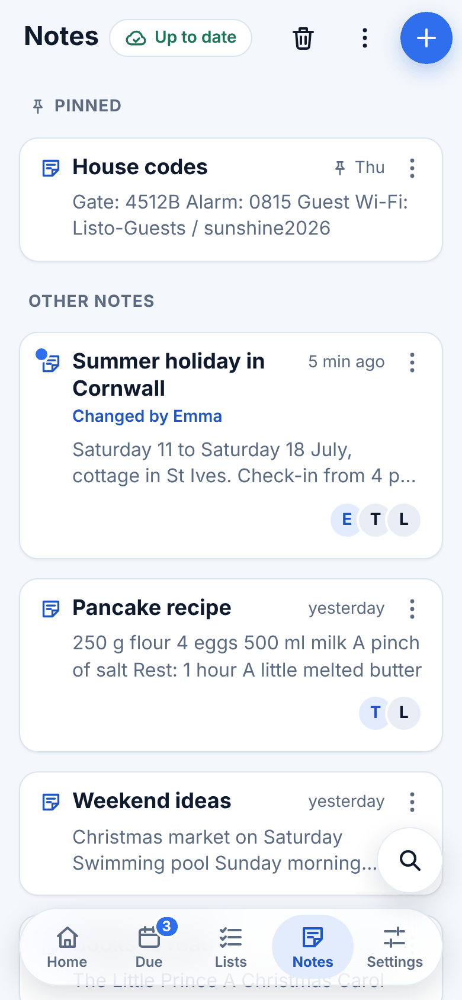 |
| Tasks | “Due” | Wishes, reservations | “To give” | Notes |
| 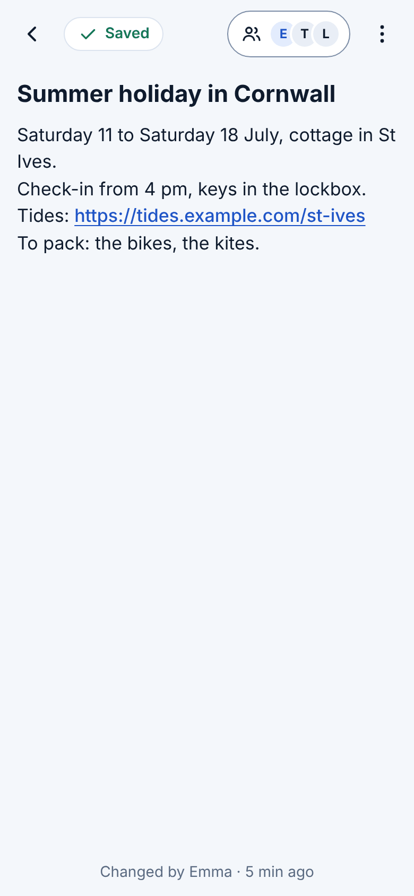 | 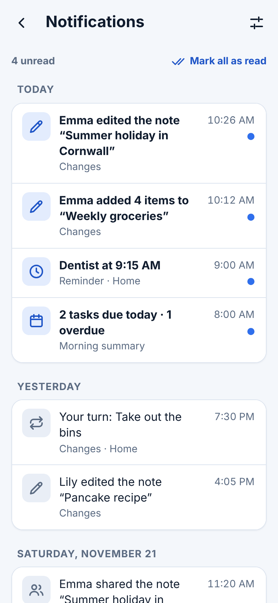 | 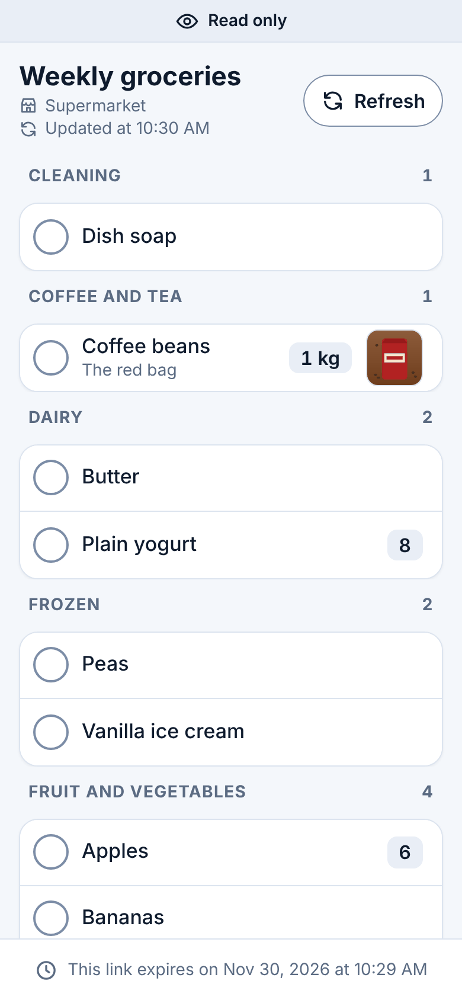 | 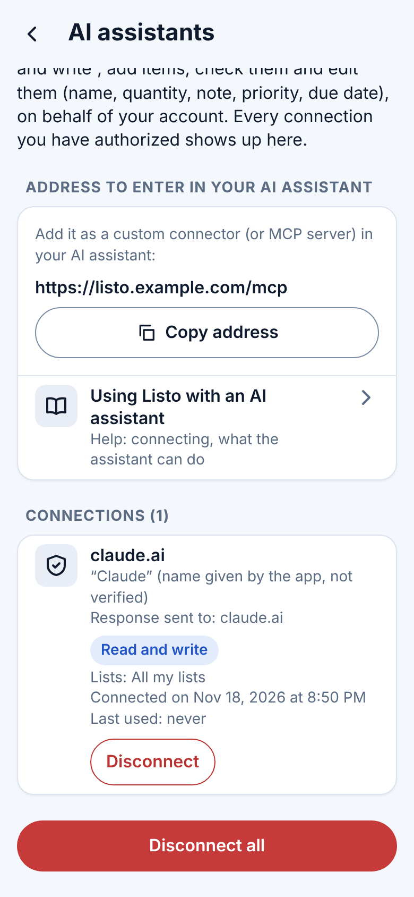 | 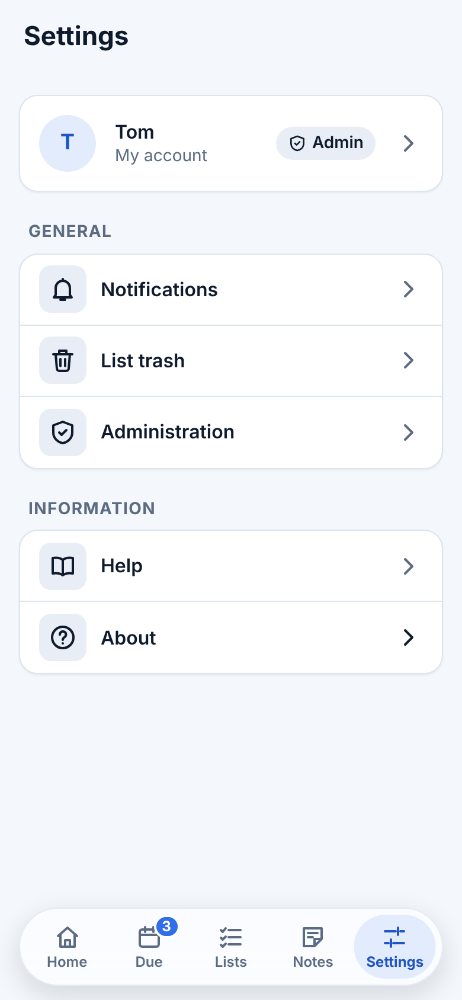 |
| Shared note | Notifications | Public link | “AI assistants” | Settings |

*Demo instance, made-up data, account in English.*

## Installation in three commands

You need a Linux server with Docker, a domain name, and an HTTPS reverse proxy, any one will do (Nginx Proxy Manager, Caddy, Traefik, nginx, Apache…).

```sh
mkdir -p /opt/listo && cd /opt/listo     # then copy docker-compose.yml there and adjust it
docker compose up -d                     # downloads and starts Listo
docker logs listo                        # shows the setup code for the first Admin
```

The full step-by-step (settings, what the proxy must do with an example for Nginx Proxy Manager, secret key, checks) is in the guide, [Installation chapter](docs/guide.en.md#installation). Backups: [guide](docs/guide.en.md#sauvegardes). Restore, updates and server troubleshooting: the operations guide, [docs/exploitation.md](docs/exploitation.md) (in French).

## Limits

- **No data sent anywhere other than your server**, except for three exceptions that can be turned off: the check for a new version (GitHub), the name of a scanned product (Open Food Facts) and **push notifications**, off by default (`LISTO_PUSH=on` turns them on; end-to-end encrypted content, but Apple, Google, Mozilla or Microsoft see the time, the size of the message and the receiving device). If you connect an AI assistant such as Claude (`LISTO_MCP=on`; `LISTO_MCP_SITES` can limit which assistant websites are accepted), the lists you allowed are sent to it when you ask it something. Optional sign-in through your own OpenID Connect identity provider, for example Authelia, Authentik or Pocket ID (`LISTO_OIDC=on`, [guide](docs/guide.en.md#sso-serveur)). In French and English, no payment; notifications on iPhone and iPad: iOS 16.4 or later, with Listo installed on the home screen ([Notifications chapter](docs/guide.en.md#notifications)).

## Useful links

- [The online guide](https://magicgg91.github.io/listo/) ([in French](https://magicgg91.github.io/listo/fr/)), or [docs/guide.en.md](docs/guide.en.md) in the repository (in French: [docs/guide.md](docs/guide.md)): for everyone.
- [docs/cahier-des-charges.md](docs/cahier-des-charges.md) (in French): features, rights, data model, security, decisions.
- [docs/developpement.md](docs/developpement.md) (in French): code organization, tests, checks on phones; [docs/mcp-cadrage.md](docs/mcp-cadrage.md) (in French): the design of access for AI assistants (MCP); [design/README.md](design/README.md): the design kit.

## Security

Listo's port is only published on the local network; only the HTTPS proxy must be able to reach it. Hashed passwords, protected cookies, lockout after 5 attempts, strict content security policy. To report a vulnerability, privately: [SECURITY.md](SECURITY.md).

## Licence and credits

- **Apache-2.0** licence, © magicgg91: [LICENSE](LICENSE). If you reuse it, keep [NOTICE](NOTICE) and the author credit. Contributing: [CONTRIBUTING.md](CONTRIBUTING.md).
- Barcode reader: [zxing-wasm](https://github.com/Sec-ant/zxing-wasm) (MIT and Apache-2.0). Product names: [Open Food Facts](https://world.openfoodfacts.org) (ODbL). Developed with the help of Claude (Anthropic).
